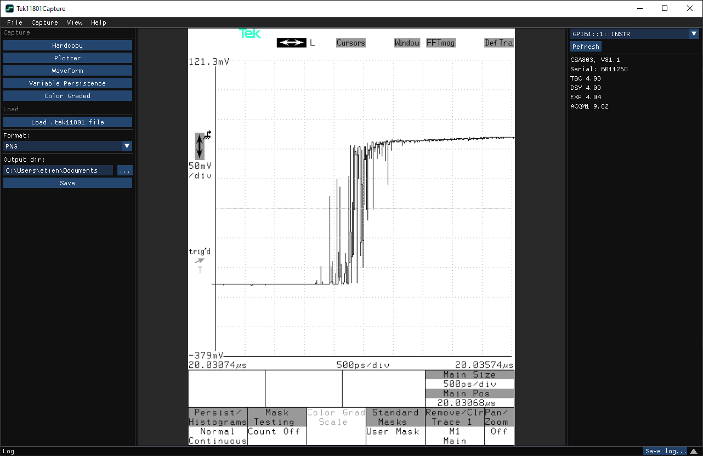
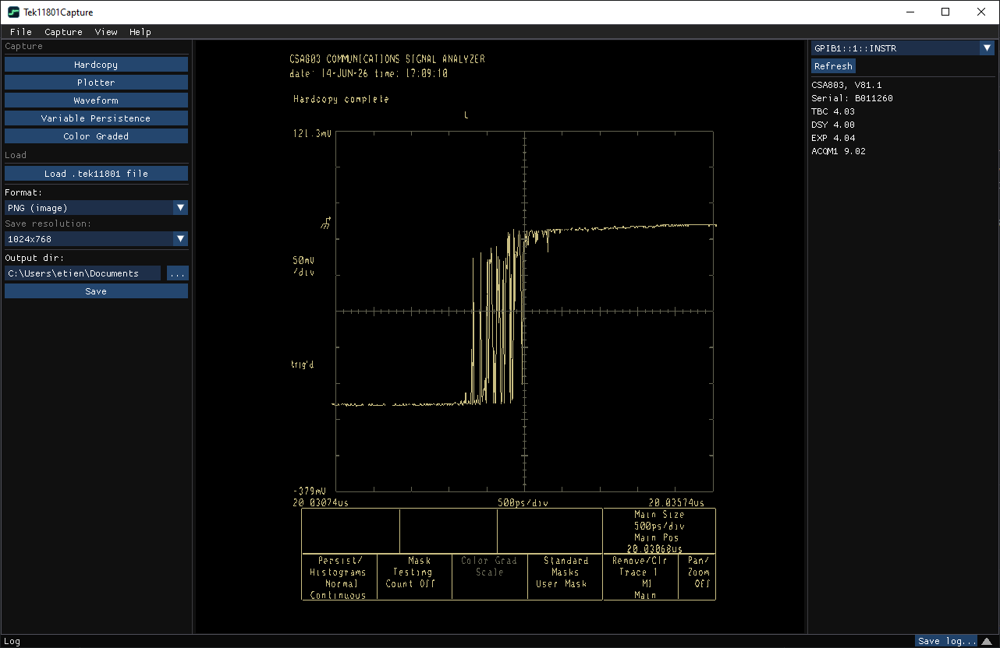
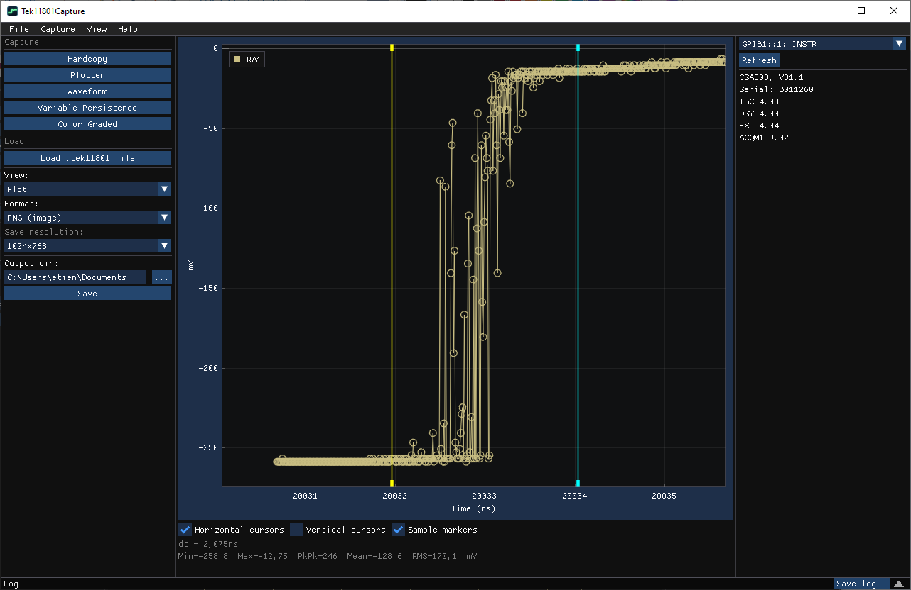
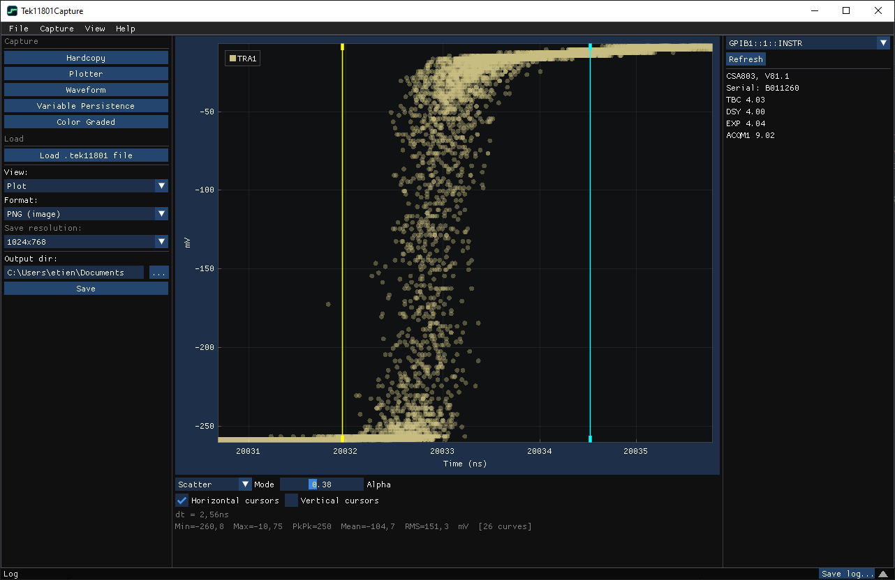
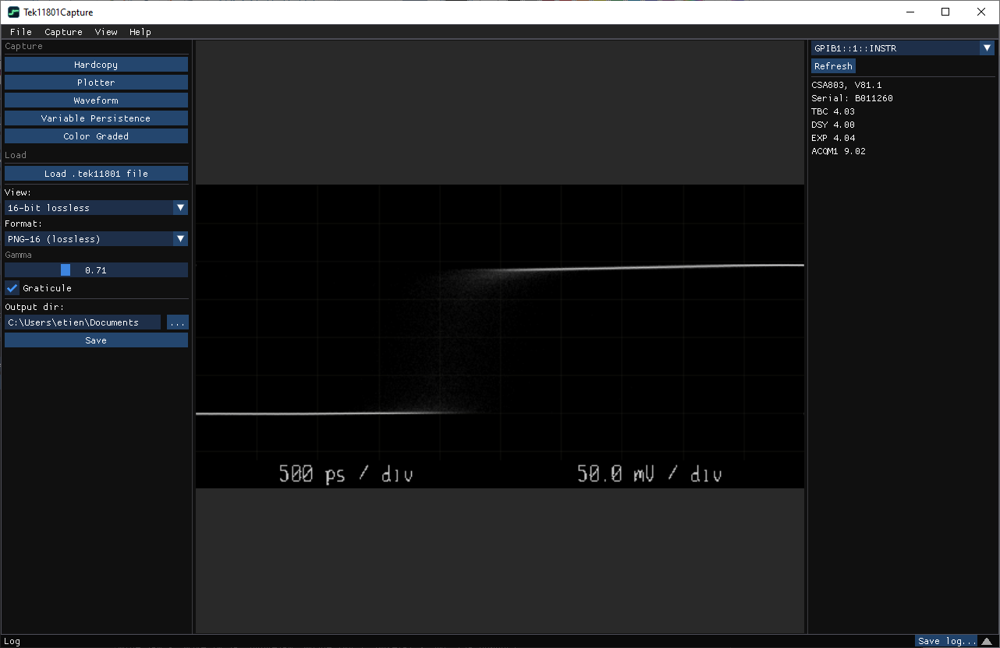

# Tek11801Capture

Capture screen images, plots, and waveform data from Tektronix CSA803-family
Communications Signal Analyzers and 11800-family Digital Sampling Oscilloscopes
to your Windows PC over GPIB — with one click.

These classic instruments have no modern, host-friendly way to get a picture or
a measurement off the screen. Until now your options were photographing the CRT
or hand-rolling plotter scripts. Tek11801Capture pulls a screen image, a vector
hardcopy, a waveform, or the color-graded display straight into a file you can
open, share, or archive.

## What it can capture

Pick an instrument, pick an output folder, click a button. Every capture appears
in a live preview first — you review it, adjust the view if you like, then save.

- **Hardcopy** — a raster screenshot of the instrument display, saved as a
  standard TIFF/PNG/JPG image. Looks exactly like what's on the CRT.
- **Plotter** — a crisp vector rendering of the screen (HP-GL), saved as a `.plt`
  plot file or rendered to PNG/TIFF/JPG.
- **Waveform** — the data behind the currently displayed traces. All visible
  traces are captured at once, plotted on an interactive graph with cursors and
  measurements (min/max, peak-to-peak, mean, RMS, Δt/Δv). Save as a lossless
  `.tek11801` data file or as an image.
- **Variable Persistence** — the variable-persistence curves of the displayed
  traces, plotted as a density scatter.
- **Color Graded** — the instrument's color-graded display (the 16-bit per-pixel
  intensity matrix), rendered with a choice of color schemes — Green phosphor,
  Heatmap, or Grayscale — with an adjustable gamma and an optional graticule
  overlay. Save lossless (16-bit PNG/TIFF) or as a regular image.

You can also **reload** a `.tek11801` waveform or variable-persistence file you
saved earlier and re-preview or re-export it — no instrument required.

*Hardcopy — raster screenshot streamed directly from the instrument*

*Plotter — vector HP-GL hardcopy rendered on the host*

*Waveform — interactive plot with time cursors and measurements*

*Variable Persistence — density scatter of accumulated persistence curves*

*Color Graded — 16-bit pixel-bin matrix with graticule overlay*

## Requirements

- **Windows 10 or Windows 11** (64-bit).
- **A VISA runtime** installed. The tool talks to the instrument through the
  standard VISA layer, so any vendor's VISA implementation works — NI-VISA,
  Keysight IO Libraries Suite, or another compatible VISA. The app will tell you
  clearly if it can't find a VISA runtime.
- **A GPIB connection to the instrument** — typically a USB-to-GPIB adapter (e.g.
  NI GPIB-USB-HS, Keysight 82357B, or equivalent) between your PC and the scope.
- **A supported instrument:** CSA803, CSA803A, CSA803C, 11801, 11801A, 11801B,
  or 11801C.

> Note: GPIB is the only supported connection in this version (no RS-232).

## Installing

Two options are provided:

- **`Tek11801Capture-Installer-1.0.0.0.exe`** — the installer. Run it and follow the
  prompts. Recommended for most users.
- **`Tek11801Capture-1.0.0.0.zip`** — a portable build. Unzip anywhere and run
  `Tek11801Capture.exe`. Keep all the files in the zip together in the same
  folder.

## Using it

1. **Connect** your instrument to the PC over GPIB and power it on.
2. **Launch** Tek11801Capture.
3. **Pick your instrument** from the dropdown at the top. The tool scans the GPIB
   bus on startup; use the **Refresh** button if you connect the instrument
   afterward. Once selected, its model, firmware, and serial number appear in the
   header.
4. **Choose an output folder** for your saved files.
5. **Click a capture button** (Hardcopy, Plotter, Waveform, Variable Persistence,
   or Color Graded). A progress dialog shows the transfer; large screen captures
   can take a few seconds.
6. **Review the preview.** Switch view modes where available (e.g. waveform
   Plot vs. raw bytes, or the pixel-bin color schemes), pan/zoom the plot, toggle
   cursors, and adjust gamma.
7. **Click Save** to write the file. Each save writes one file; switch the view
   or format and save again to export another variant of the same capture.

Saved files are named automatically, e.g.
`tek11801-20260614-163012-waveform.tek11801`.

### Tips for specific captures

- **Color Graded** needs the instrument to actually be in color-graded display
  mode with acquisitions accumulated. If it isn't, the tool tells you so and
  suggests what to do, rather than failing silently.
- **Variable Persistence** needs the instrument in variable-persistence mode.
- **Waveform / Variable Persistence** capture every trace currently displayed on
  the instrument, so set up the screen the way you want it before capturing.

## File formats at a glance

| Capture              | Native / lossless                 | Image              |
| -------------------- | --------------------------------- | ------------------ |
| Hardcopy             | —                                 | PNG, TIFF, JPG     |
| Plotter              | `.plt` (HP-GL)                    | PNG, TIFF, JPG     |
| Waveform             | `.tek11801` (raw data)            | PNG, TIFF, JPG     |
| Variable Persistence | `.tek11801` (raw data)            | PNG, TIFF, JPG     |
| Color Graded         | PNG-16, TIFF-16 (16-bit lossless) | PNG-8, TIFF-8, JPG |

`.tif`, `.plt`, and `.png`/`.tiff`/`.jpg` files open in any standard image or
plot viewer. `.tek11801` is this tool's own lossless data format and can be
reloaded here later.

## Troubleshooting

The app has a built-in **Help > Troubleshooting** guide. Common issues:

- **Instrument not listed** — check the GPIB cable and adapter, make sure the
  instrument is powered on, then click **Refresh**. Confirm a VISA runtime is
  installed.
- **"Color-graded mode inactive" or "No acquisitions"** — put the instrument
  into color-graded display mode and let it accumulate acquisitions, then retry.
- **Hardcopy/Plotter times out** — these instruments render the whole frame
  before sending it, which can be slow on older units; the tool waits up to a few
  minutes. If it still times out, check the bus connection.
- **Logs** — a log pane at the bottom of the window (double-click to expand)
  records what's happening; you can save it from there. Optional rolling log
  files can be enabled and are kept under
  `%LOCALAPPDATA%\Tek11801Capture\logs`.

## Settings

Your preferences (output folder, view/format choices, gamma, window layout, log
verbosity) are remembered between sessions automatically.
